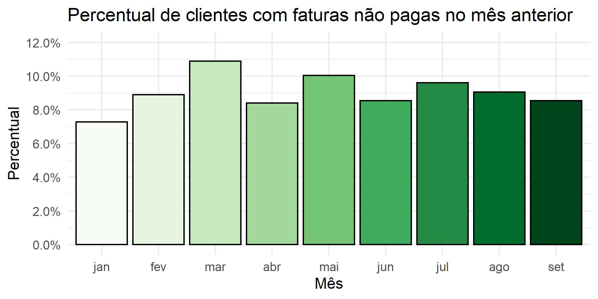
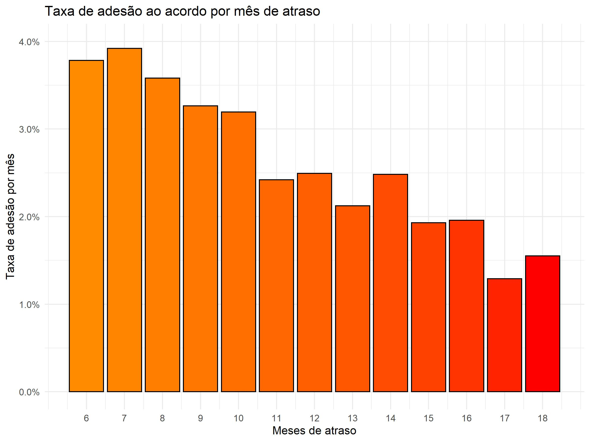

```{r setup, include=FALSE}
knitr::opts_chunk$set(echo = TRUE, eval = FALSE)
```

***

# Questão 1

Nesta questão, foram realizadas análises sobre uma base de dados a fim de calcular alguns parâmetros.

As funções foram testadas utilizando uma amostra com 10000 observações selecionadas aleatoriamente da população a fim de economizar tempo e facilitar a codificação. Os dados originais em momento algum são alterados, sendo sempre criados novos dataframes que irão receber as informações atualizadas conforme os itens pedem.

A importação dos dados, bem como os tratamentos, foram realizados utilizando os pacotes **tidyverse** e **lubridate**.

```{r}
## setup
library(tidyverse)
library(lubridate)

## importacao dos dados
q1_data = read_table(unz("./data/data.zip", "Q1_Base.txt"))
```

***

## 1.1

Aqui, foram feitos os devidos tratamentos e cálculos necessários para obtermos o percentual de faturas cujo cliente associado não pagou a fatura do mês anterior. 

O resultado obtido foi resumido abaixo para melhor visualização, mas o dataframe pode ser acessado diretamente pelo *q1_script.R*, na pasta *code*.

```{r}
# calculo do percentual
percentual = q1_data %>%
  mutate(MES = month(DT_VENCIMENTO, label = TRUE, locale = "Portuguese")) %>%
  select(-ID_CONTA, -VL_FATURA, -DT_VENCIMENTO) %>%
  group_by(MES) %>%
  summarise(PERCENTUAL_PGTO = sum(DS_ROLAGEM == "FX1")/n())

# grafico
percentual_plot = percentual %>%
  ggplot(aes(x = MES, y = PERCENTUAL_PGTO, fill = MES)) +
  geom_bar(stat = "identity", colour ="black") +
  scale_fill_brewer(palette = "Greens") +
  theme_minimal() +
  scale_y_continuous(labels = scales::percent, 
                     limits = c(0, 0.12),
                     breaks = c(0, 0.02, 0.04, 0.06, 0.08, 0.10, 0.12)) +
  labs(x = "Mês", y = "Percentual",
       title = "Percentual de clientes com faturas não pagas no mês anterior") +
  theme(legend.position = "none")
```

```{r, eval = TRUE, echo = FALSE, out.width = "350px", fig.align = "center"}

```

***

## 1.2

Neste item, criamos um novo dataframe somente com os clientes que tiveram fatura emitida no mês de setembro, e isso irá nos auxiliar a filtrar os clientes da maneira desejada.

```{r}
# criacao de dataframe auxiliar
clientes_setembro = q1_data %>%
  mutate(MES = month(DT_VENCIMENTO, label = TRUE, locale = "Portuguese")) %>%
  filter(MES == "set")

# condicionamento dos dados e criacao da base resposta
q1_resposta = merge(clientes_setembro, 
                         q1_data %>%
                           mutate(MES = month(DT_VENCIMENTO, 
                                              label = TRUE, 
                                              locale = "Portuguese")) %>%
                           filter(ID_CONTA %in% clientes_setembro$ID_CONTA) %>%
                           filter(MES %in% c("mar", "abr", "mai", "jun", "jul", "ago")) %>%
                           group_by(ID_CONTA) %>%
                           summarise(QTD_FATURAS_ULT_6M = n(),
                                     VL_MEDIO_FATURA = mean(VL_FATURA),
                                     QTD_FATURAS_ULT_6M_FX1 = sum(DS_ROLAGEM == 'FX1')),
                         by = "ID_CONTA") %>%
  select(-MES, -VL_FATURA)

# exportando o dataframe como arquivo txt
output_file = "./output/Q1_Resposta.txt"

if (file.exists(output_file)){
  file.remove(output_file)
}

write_tsv(q1_resposta, output_file)
```

Podemos carregar a base criada para verificar se os dados foram salvos corretamente:

```{r, eval = TRUE}
dplyr::glimpse(read.table("../output/Q1_Resposta.txt", nrows = 50, header = TRUE))
```

***

# Questão 2

## 2.1

Assim como na primeira questão, neste item importamos o banco de dados e aplicamos os devidos tratamentos para a obtenção dos dados desejados.

Note que como a variável que estamos interessados (**Resposta**) está presente somente na primeira base de dados, só trabalhamos com ela nesse momento.

O resultado obtido foi resumido graficamente para melhor visualização, mas o código e suas respectivas saídas podem ser verificados no arquivo *q2_script.R*, na pasta *code*.

```{r}
## setup
library(tidyverse)
library(lubridate)

# importacao da base
q2_data_1 = read.table(unz("./data/data.zip", "Q2_Base1.txt"),
                       sep = "\t", 
                       header = TRUE)

# calculo do percentual
percentual_adesao = q2_data_1 %>%
  mutate(NU_MESES_ATRASO = as.integer(NU_DIAS_ATRASO/30)) %>%
  group_by(NU_MESES_ATRASO) %>%
  summarise(NU_ADESAO_MES = sum(RESPOSTA == 1)/n())

# grafico
percentual_adesao_plot = percentual_adesao %>%
  ggplot(aes(x = NU_MESES_ATRASO, y = NU_ADESAO_MES)) +
  geom_col(aes(fill = NU_MESES_ATRASO), colour = "black") +
  scale_fill_gradient(low = "darkorange",
                      high = "red") +
  theme_minimal() +
  scale_y_continuous(labels = scales::percent,
                     limits = c(0, 0.04)) +
  scale_x_continuous(breaks = c(6:18)) +
  labs(x = "Meses de atraso",
       y = "Taxa de adesão por mês",
       title = "Taxa de adesão ao acordo por mês de atraso") +
  theme(legend.position = "none")

```

```{r, eval = TRUE, echo = FALSE, out.width = "350px", fig.align = "center"}

```

***
\newpage
## 2.2

Observando a base de dados fornecida, o modelo de predição mais adequado seria um modelo de classificação utilizando um algoritmo de regressão logística.

Um modelo de classificação tenta classificar os objetos em análise em grupos diferentes, e a partir daí podemos tomar uma decisão com base nos resultados. O algoritmo de regressão logística, em específico, busca calcular a probabilidade de um evento ocorrer ou não de acordo com as variáveis associadas ao evento em questão.

Aplicando na nossa base de dados, a estratégia a ser utilizada seria analisar as variáveis relacionadas aos clientes (ex: quantas vezes foi tentado o contato, valor da dívida, número de dias em atraso, entre outros) e buscar entender o tipo de cliente que mais adere aos acordos da empresa. Com essa informação em mãos, seria possível direcionar as cobranças aos clientes que possuem maior probabilidade de aceitar um acordo, o que reduziria tempo e recursos perdidos cobrando clientes que, de acordo com os resultados do nosso modelo, tem uma baixa taxa de adesão.

## 2.3


***

# Questão 3

Para a resolução dessa questão, que versa sobre SQL, foi criado um banco de dados fictício utilizando o modelo dado no documento para testar as queries e verificar seu funcionamento.

Todo o processo foi feito utilizando o pacote **RSQLite**.

Quatro dataframes foram criados, referentes a cada tabela, e inseridos no banco de dados *vendas_sample.sqlite3*, que está disponibilizado na pasta *data*.

O script utilizado (*q3_queries.R*), bem como um arquivo de texto somente com as queries (*q3_queries.txt*), estão disponibilizados na pasta *code*.

```{r, eval = TRUE}
# setup
library(RSQLite)

# criando banco de dados
sample_db = "../data/vendas_sample.sqlite3"
conn = dbConnect(SQLite(), sample_db)

# inserindo dados no bd para testar as queries
df_Tempo = data.frame(id_tempo = c(1, 2, 3, 4, 5, 6),
                      dt_ref = c("2020-01-01", "2020-03-02", 
                                 "2020-03-01", "2020-04-01", 
                                 "2020-05-01", "2020-01-16"),
                      nu_semana = c(1, 1, 1, 1, 1, 2),
                      nu_mes = c(1, 3, 3, 4, 5, 1),
                      nu_ano = c(2020, 2020, 2020, 2020, 2020, 2020))

df_Loja = data.frame(id_loja = c(5, 6, 7, 8),
                     ds_uf = c("CE", "CE", "SP", "RJ"),
                     nu_cep = c(123, 456, 789, 10123))

df_Pessoa = data.frame(id_pessoa = c(10, 11, 12, 13, 14),
                       nm_pessoa = c("João", "Maria", "Bruno", "Felipe", "José"))

df_Vendas = data.frame(id_venda = c(20, 21, 22, 23, 24, 25),
                       vl_venda = c(55, 66, 77, 88, 99, 88),
                       id_loja = c(5, 6, 7, 8, 7, 5),
                       id_tempo = c(1, 2, 3, 4, 5, 6),
                       id_pessoa = c(10, 11, 12, 13, 12, 13))

dbRemoveTable(conn, "d_Tempo")
dbWriteTable(conn, "d_Tempo", df_Tempo)

dbRemoveTable(conn, "d_Loja")
dbWriteTable(conn, "d_Loja", df_Loja)

dbRemoveTable(conn, "d_Pessoa")
dbWriteTable(conn, "d_Pessoa", df_Pessoa)

dbRemoveTable(conn, "f_Vendas")
dbWriteTable(conn, "f_Vendas", df_Vendas)

```

## 3.1

Retorna as compras realizadas no mês de janeiro/2020 em lojas do Ceará.

Essa query foi feita utilizando comandos básicos de SQL, juntando as tabelas e condicionando a busca no mês, ano e unidade federativa.

```{r, eval = TRUE}
dbGetQuery(conn,
           "SELECT p.id_pessoa, p.nm_pessoa, t.dt_ref, v.vl_venda
           FROM f_Vendas AS v
           INNER JOIN d_Pessoa AS p
           ON v.id_pessoa = p.id_pessoa
           INNER JOIN d_Tempo AS t
           ON v.id_tempo = t.id_tempo
           INNER JOIN d_Loja AS l
           ON v.id_loja = l.id_loja
           WHERE t.nu_mes = 1
           AND t.nu_ano = 2020
           AND l.ds_uf = 'CE'")
```

## 3.2

Retorna a quantidade de compras por cliente realizadas no mês de março/2020.

Novamente, foram utilizandos comandos simples do SQL. A contagem de compras foi realizada pela frequência de observações no campo *id_venda*, já que no fim agrupamos os resultados por cliente.

```{r, eval = TRUE}
dbGetQuery(conn,
           "SELECT p.id_pessoa, COUNT(v.id_venda) AS qtd_compras 
           FROM f_Vendas as v
           INNER JOIN d_pessoa AS p
           ON v.id_pessoa = p.id_pessoa
           INNER JOIN d_tempo AS t
           ON v.id_tempo = t.id_tempo
           WHERE t.nu_mes = 3
           AND t.nu_ano = 2020
           GROUP BY p.id_pessoa")
```

## 3.3

Retorna o ID e nome dos clientes que NÃO realizaram compras em março/2020.

Nesta query, foi utilizada uma subquery para retirar da busca os clientes que possuem compras em março/2020.
Foi necessário usar uma subquery pois o *SQLite* não suporta o comando **RIGHT JOIN**, que é suportado em outros bancos de dados como o *MySQL* ou o *PostgreSQL* e facilitaria a execução dessa query.

```{r, eval = TRUE}
dbGetQuery(conn,
           "SELECT DISTINCT p.id_pessoa, p.nm_pessoa
           FROM d_Pessoa AS p
           LEFT JOIN f_Vendas AS v
           ON p.id_pessoa = v.id_pessoa
           LEFT JOIN d_Tempo AS t
           ON v.id_tempo = t.id_tempo
           WHERE t.nu_mes IS NOT 3
           AND p.id_pessoa NOT IN
             (SELECT p.id_pessoa
             FROM d_Pessoa AS p
             LEFT JOIN f_Vendas AS v
             ON p.id_pessoa = v.id_pessoa
             LEFT JOIN d_Tempo AS t
             ON v.id_tempo = t.id_tempo
             WHERE nu_mes = 3)")
```

## 3.4

Aqui, assim como no item 3.2, as observações foram agrupadas pelo ID do cliente e selecionamos a maior data de referência associada a um determinado ID.

```{r, eval = TRUE}
dbGetQuery(conn,
           "SELECT p.id_pessoa, MAX(dt_ref) AS ultima_compra
           FROM f_Vendas AS v
           INNER JOIN d_Tempo as t
           ON v.id_tempo = t.id_tempo
           INNER JOIN d_Pessoa as p
           ON v.id_pessoa = p.id_pessoa
           GROUP BY p.id_pessoa")
```

