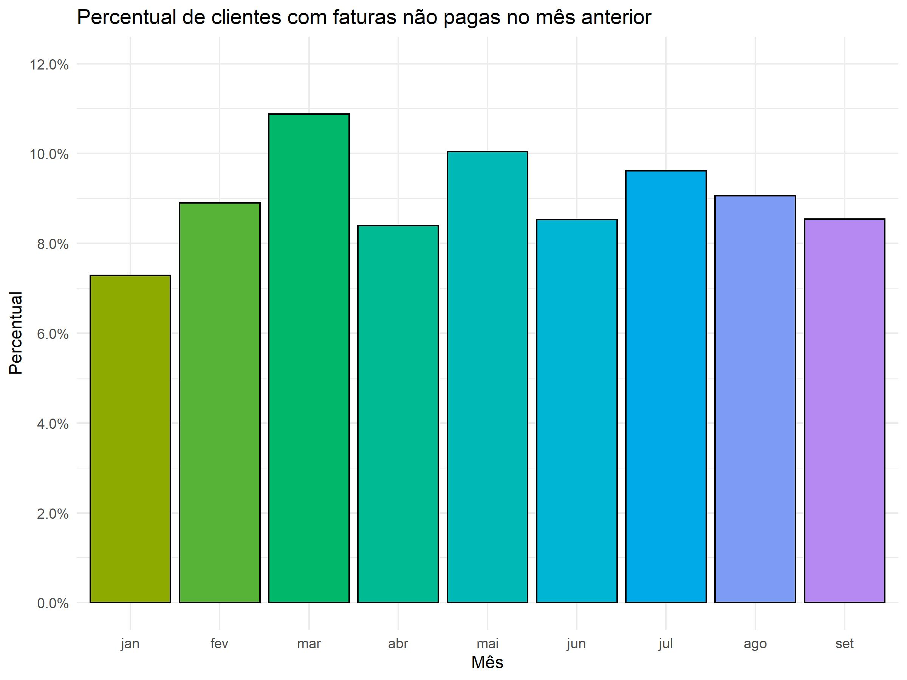

```{r setup, include=FALSE}
knitr::opts_chunk$set(echo = TRUE, eval = FALSE)
```

***

# Questão 1

Nesta questão, foram realizadas análises sobre uma base de dados a fim de calcular alguns parâmetros.

As funções foram testadas utilizando uma amostra com 10000 observações selecionadas aleatoriamente da população a fim de economizar tempo e facilitar a codificação. Os dados originais em momento algum são alterados, sendo sempre criados novos dataframes que irão receber as informações atualizadas conforme os itens pedem.

A importação dos dados, bem como os tratamentos, foram realizados utilizando os pacotes **tidyverse** e **lubridate**.

```{r}
## setup
library(tidyverse)
library(lubridate)

## importacao dos dados
q1_data = read_table(unz("./data/data.zip", "Q1_Base.txt"))
```

***

## 1.1

Aqui, foram feitos os devidos tratamentos e cálculos necessários para obtermos o percentual de faturas cujo cliente associado não pagou a fatura do mês anterior. 

O resultado obtido foi resumido abaixo para melhor visualização, mas o dataframe pode ser acessado diretamente pelo *q1_script.R*, na pasta *code*.

```{r}
# calculo do percentual
percentual = q1_data %>%
  mutate(MES = month(DT_VENCIMENTO, label = TRUE, locale = "Portuguese")) %>%
  select(-ID_CONTA, -VL_FATURA, -DT_VENCIMENTO) %>%
  group_by(MES) %>%
  summarise(PERCENTUAL_PGTO = sum(DS_ROLAGEM == "FX1")/n())

# grafico
percentual_plot = percentual %>%
  ggplot(aes(x = MES, y = PERCENTUAL_PGTO, fill = MES)) +
  geom_bar(stat = "identity", colour ="black") +
  scale_fill_brewer(palette = "Greens") +
  theme_minimal() +
  scale_y_continuous(labels = scales::percent, 
                     limits = c(0, 0.12),
                     breaks = c(0, 0.02, 0.04, 0.06, 0.08, 0.10, 0.12)) +
  labs(x = "Mês", y = "Percentual",
       title = "Percentual de clientes com faturas não pagas no mês anterior") +
  theme(legend.position = "none")
```

```{r, eval = TRUE, echo = FALSE, out.width = "350px", fig.align = "center"}

```

***

## 1.2

Neste item, criamos um novo dataframe somente com os clientes que tiveram fatura emitida no mês de setembro, e isso irá nos auxiliar a filtrar os clientes da maneira desejada. A base de dados criada pode ser encontrada na pasta *output* como *Q1_Resposta.txt*.

```{r}
# criacao de dataframe auxiliar
clientes_setembro = q1_data %>%
  mutate(MES = month(DT_VENCIMENTO, label = TRUE, locale = "Portuguese")) %>%
  filter(MES == "set")

# condicionamento dos dados e criacao da base resposta
q1_resposta = merge(clientes_setembro, 
                         q1_data %>%
                           mutate(MES = month(DT_VENCIMENTO, 
                                              label = TRUE, 
                                              locale = "Portuguese")) %>%
                           filter(ID_CONTA %in% clientes_setembro$ID_CONTA) %>%
                           filter(MES %in% c("mar", "abr", "mai", "jun", "jul", "ago")) %>%
                           group_by(ID_CONTA) %>%
                           summarise(QTD_FATURAS_ULT_6M = n(),
                                     VL_MEDIO_FATURA = mean(VL_FATURA),
                                     QTD_FATURAS_ULT_6M_FX1 = sum(DS_ROLAGEM == 'FX1')),
                         by = "ID_CONTA") %>%
  select(-MES, -VL_FATURA)

# exportando o dataframe como arquivo txt
output_file = "./output/Q1_Resposta.txt"

if (file.exists(output_file)){
  file.remove(output_file)
}

write_tsv(q1_resposta, output_file)
```

Podemos carregar a base criada para verificar se os dados foram salvos corretamente:

```{r, eval = TRUE}
dplyr::glimpse(read.table("../output/Q1_Resposta.txt", nrows = 50, header = TRUE))
```

***