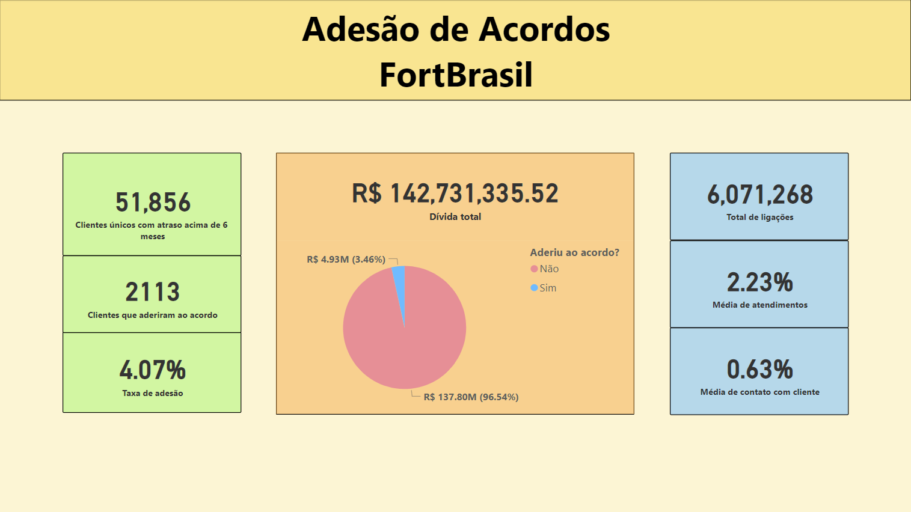
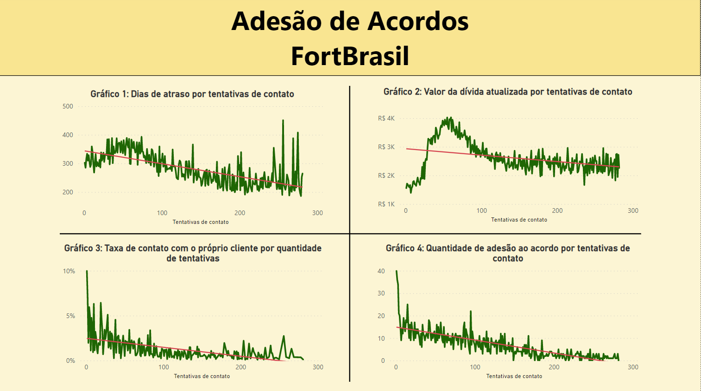

```{r setup, include=FALSE}
knitr::opts_chunk$set(echo = TRUE, eval = FALSE)
```

***

# Questão 2

## 2.1

Assim como na primeira questão, neste item importamos o banco de dados e aplicamos os devidos tratamentos para a obtenção dos dados desejados - o percentual de acordos aceitos por mês. A faixa de atraso utilizada foi mensal, para fins de simplicidade.

Note que como a variável que estamos interessados (**Resposta**) está presente somente na primeira base de dados, só trabalhamos com ela nesse momento.

O resultado obtido foi resumido graficamente para melhor visualização, mas o código e suas respectivas saídas podem ser verificados no arquivo *q2_script.R*, na pasta *code*.

```{r}
## setup
library(tidyverse)
library(lubridate)

# importacao da base
q2_data_1 = read.table(unz("./data/data.zip", "Q2_Base1.txt"),
                       sep = "\t", 
                       header = TRUE)

# calculo do percentual
percentual_adesao = q2_data_1 %>%
  mutate(NU_MESES_ATRASO = as.integer(NU_DIAS_ATRASO/30)) %>%
  group_by(NU_MESES_ATRASO) %>%
  summarise(NU_ADESAO_MES = sum(RESPOSTA == 1)/n())

# grafico
percentual_adesao_plot = percentual_adesao %>%
  ggplot(aes(x = NU_MESES_ATRASO, y = NU_ADESAO_MES)) +
  geom_col(aes(fill = NU_MESES_ATRASO), colour = "black") +
  scale_fill_gradient(low = "darkorange",
                      high = "red") +
  theme_minimal() +
  scale_y_continuous(labels = scales::percent,
                     limits = c(0, 0.04)) +
  scale_x_continuous(breaks = c(6:18)) +
  labs(x = "Meses de atraso",
       y = "Taxa de adesão por mês",
       title = "Taxa de adesão ao acordo por mês de atraso") +
  theme(legend.position = "none")

```

```{r, eval = TRUE, echo = FALSE, out.width = "350px", fig.align = "center"}
knitr::include_graphics('../output/Q2_Grafico.jpg')
```

***

## 2.2

Observando a base de dados fornecida, o modelo de predição mais adequado seria um modelo de classificação utilizando um algoritmo de regressão logística.

Um modelo de classificação tenta classificar os objetos em análise em grupos diferentes, e a partir daí podemos tomar uma decisão com base nos resultados. O algoritmo de regressão logística, em específico, busca calcular a probabilidade de um evento ocorrer ou não de acordo com as variáveis associadas ao evento em questão.

Aplicando na nossa base de dados, a estratégia a ser utilizada seria analisar as variáveis relacionadas aos clientes (ex: quantas vezes foi tentado o contato, valor da dívida, número de dias em atraso, entre outros) e buscar entender o tipo de cliente que mais adere aos acordos da empresa. Com essa informação em mãos, seria possível direcionar as cobranças aos clientes que possuem maior probabilidade de aceitar um acordo, o que reduziria tempo e recursos perdidos cobrando clientes que, de acordo com os resultados do nosso modelo, tem uma baixa taxa de adesão.

## 2.3

Após a criação do nosso modelo preditivo, devemos implementar alguns métodos estatísticos para calcular sua eficiência e performance. A melhor métrica para se utilizar varia de acordo com o objetivo e o tipo de modelo, tendo inúmeras opções e nenhuma sendo necessariamente melhor que a outra. 

Para o algoritmo de regressão logística, podemos utilizar uma matriz de confusão para determinar a **acurácia** do nosso modelo - ou seja, quantas vezes o modelo acertou na classificação. A **acurácia** é calculada pela razão entre os acertos e os erros do algoritmo:

$$Acurácia = \frac{TP + TN}{TP + TN + FP + FN}$$

onde TP e TN são verdadeiros positivos e negativos, e FP e FN são falsos positivos e negativos.

Uma outra alternativa que temos para medir a eficácia do nosso modelo é a validação **AUC** (Area Under ROC Curve). Esse método calcula a área abaixo de uma curva gerada a partir da taxa de TPs e FPs (denominada curva ROC), e isso nos indica a proporção entre essas duas ocorrências na classificação - essencialmente, acertos e erros.


## 2.4

Para criarmos o relatório analítico, primeiro iremos consolidar um banco de dados com as informações relevantes ao nosso relatório. O julgamento de quais informações são ou não relevantes foi baseada em conhecimento prévio a respeito do negócio, e criação de hipóteses a respeito de quais variáveis podem ou não ter alguma influência na adesão dos acordos. Para verificarmos se essas informações são, de fato, relevantes para o nosso problema, o ideal seria implementar um algoritmo preditivo para checar a correlação entre as variáveis e a resposta que queremos.

O código utilizado para a obtenção, limpeza e tratamento dos dados está a seguir e também pertence ao *q2_script.R*, do item 2.1. A base de dados utilizada para o relatório pode ser encontrada na pasta *data* como *Q2_BaseCompleta.txt*.

```{r}
# importacao dos dados
q2_data_2 = read.table(unz("./data/data.zip", "Q2_Base2.txt"),
                       sep = "\t", 
                       header = TRUE)

q2_data_3 = read.table(unz("./data/data.zip", "Q2_Base3.txt"),
                       sep = "\t", 
                       header = TRUE)

q2_data_4 = read.table(unz("./data/data.zip", "Q2_Base4.txt"),
                       sep = "\t", 
                       header = TRUE)

# tratamento em coluna com formato inconsistente
q2_data_4$DT_ACORDO = as.character(as.Date(q2_data_4$DT_ACORDO))
 
q2_data_5 = read.table(unz("./data/data.zip", "Q2_Base5.txt"),
                       sep = "\t", 
                       header = TRUE)

# juntando as bases
q2_data_merged = merge(q2_data_1, q2_data_2, 
                       by = c("ID_CONTA", "DT_ACORDO"), all = TRUE) %>%
  merge(q2_data_3, 
        by = c("ID_CONTA", "DT_ACORDO"), all = TRUE) %>%
  merge(q2_data_4, 
        by = c("ID_CONTA", "DT_ACORDO"), all = TRUE) %>%
  merge(q2_data_5, 
        by = c("ID_CONTA", "DT_ACORDO"), all = TRUE)

# consolidando a base para o power bi
q2_base = q2_data_merged %>%
  select(ID_CONTA, DIVIDA_ATUAL, 
         RESPOSTA, DT_ACORDO, 
         QTD_ACIONAMENTO_6M, QTD_CPC_6M, 
         QTD_CP_6M, NU_DIAS_ATRASO) %>%
  group_by(ID_CONTA, RESPOSTA) %>%
  summarise(DIVIDA_FINAL = max(DIVIDA_ATUAL),
            RESPOSTA = max(RESPOSTA),
            DT_ACORDO = max(DT_ACORDO),
            QTD_ACIONAMENTO = max(QTD_ACIONAMENTO_6M),
            PERC_CONTATO = max(QTD_CP_6M)/QTD_ACIONAMENTO,
            PERC_CPC = max(QTD_CPC_6M)/QTD_ACIONAMENTO,
            NU_DIAS_ATRASO = max(NU_DIAS_ATRASO))

q2_base[is.na(q2_base)] = 0

# calculo outliers acionamento
q2_acionamento_outliers = 
  c((quantile(q2_data_merged$QTD_ACIONAMENTO_6M)[2])-1.5*IQR(q2_data_merged$QTD_ACIONAMENTO_6M),
    (quantile(q2_data_merged$QTD_ACIONAMENTO_6M)[4]+1.5*IQR(q2_data_merged$QTD_ACIONAMENTO_6M)))
```

\

Com a base completa em mãos, podemos carregar os dados no Power BI e realizar as análises. O arquivo referente a esse item, bem como as imagens do relatório, podem ser encontrados na pasta *output*.

```{r, eval = TRUE, echo = FALSE, out.width = "400px", fig.align = "center"}

```

Analisando numericamente, podemos já notar que a taxa de adesão aos acordos é baixa (4,07%). Consequentemente, a dívida de clientes que aceitaram o acordo representa apenas 3,46% da dívida total dos clientes inadimplentes.

Esses números ilustram bem a importância da adesão ao acordo de negociação oferecido pela empresa e a necessidade de aumentar essa taxa.

Outro número interessante de se observar é a quantidade de acionamentos para cobrança e as taxas de atendimento e contato com o próprio cliente.
Tivemos um total de aproximadamente 6mi de ligações, mas somente 2,23% dessas ligações foram atendidas e, ainda, somente 0,63% foram atendidas diretamente pelo cliente inadimplente. 

Mas ainda não podemos afirmar que as taxas baixas de atendimento podem estar relacionadas à baixa taxa de adesão. Para atestar isso, vamos analisar graficamente essas informações:

```{r, eval = TRUE, echo = FALSE, out.width = "400px", fig.align = "center"}

```

Esses gráficos mostram o comportamento de algumas variáveis conforme o **número de tentativas de contato**. Para a elaboração desses gráficos, os dados foram agrupados por cliente e tomou-se as observações acumuladas até a última data em que houve a tentativa de acordo, portanto são as informações mais atuais de cada cliente. Além disso, filtramos os outliers do número de tentativas de contato para realizar a análise (calculados também no *q2_script.R*).

* O gráfico **1** nos mostra que clientes com mais dias de atraso tendem a receber mais tentativas de contato, mas isso pode ser devido ao fato de que estamos trabalhando com dados acumulados e, consequentemente, clientes que devem há mais tempo também recebem ligações há mais tempo.

* No gráfico **2**, podemos verificar que, em média, os clientes com maior dívida final receberam de 30 a 80 ligações, e clientes com dívida final menor tendem a receber mais ligações.

* O gráfico **3** indica as taxas de uma métrica muito importante - o contato com a pessoa certa (CPC). O CPC ocorre com mais frequência em quantidades menores de tentativas de contato.

* O gráfico **4**, que mostra a quantidade absoluta de adesão ao acordo em relação ao número de tentativas de contato, é a chave para entendermos a relação dos outros gráficos com o problema de negócio que temos. 

É evidente que mais acordos são aceitos em números menores de tentativas de contato, e conforme as tentativas aumentam, menores são os números de respostas positivas. Ainda, juntando as informações dos gráficos **1**, **2** e **3**, que indicam melhores resultados com menos tentativas de ligação, podemos acreditar que a qualidade das cobranças da empresa afetam negativamente a adesão aos acordos e consequentemente a receita total.

### Conclusão:
Muitas ligações são feitas para clientes que são pouco prováveis de aderir ao acordo e pagar sua dívida (gráfico **4**), ou então que devem uma quantia reduzida (gráfico **2**). Além disso, a taxa de CPC é baixa e diminui conforme aumentamos as tentativas de contato (gráfico **3**), o que indica falta de otimização no processo de cobrança (horários, telefone correto, abordagem, entre outros). Por fim, muitas tentativas de contato são realizadas visando clientes com muitos dias de atraso (gráfico **1**), e pelo gráfico mostrado no item 2.1, clientes com mais dias (ou meses) de atraso demonstram uma menor taxa de adesão ao acordo.

***